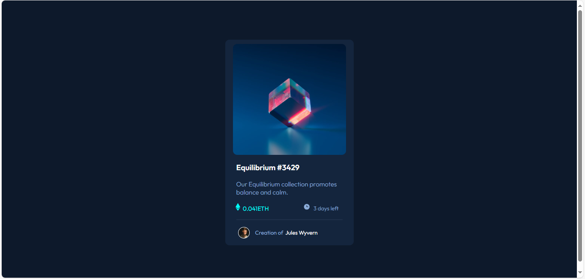

## Overview
This is a solution to the [MFT Preview card component challenge on Frontend Mentor](https://www.frontendmentor.io/challenges/nft-preview-card-component-SbdUL_w0U). Frontend Mentor challenges help you improve your coding skills by building realistic projects. 

## Features
-  Responsive Card Layout – Clean, centered component with a mobile-friendly design.
-  NFT Image with Hover Overlay – Image changes appearance and shows a view icon on hover.
-  Hover Interactions – Subtle hover effects on the title and image for an interactive feel.
-  Creator Section – Includes avatar, creator name, and styling that matches the design.
-  Semantic HTML – Well-structured HTML elements for better accessibility and SEO.
-  Custom Styling with CSS – All design elements recreated using pure CSS.
-  Google Fonts Integration – "Outfit" font imported and used throughout the card.
-  Color Scheme Matching Design – Colors based on HSL values for exact design replication.

### Screenshot

### Live site
 https://echo-script0.github.io/Order-summary-component/

### Built with

- HTML5

- CSS3 (Flexbox, HSL colors)

- Responsive Design Principles

## Author
- Aisha Adeyemo
- Frontend Mentor - (https://www.frontendmentor.io/profile/echo-script0)

